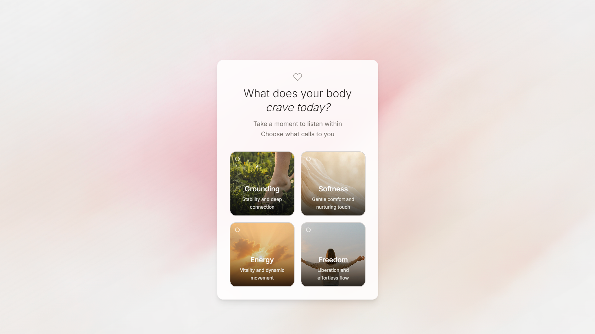

## Bella Otér - Raven Body Profile

### Overview

I created it a mobile-first, single-page experience built to simulate the first step of the **Raven Body Profile** — Bella Otér's loungewear discovery flow.

The goal of this build was to create a **visually intuitive and soothing** interface that reflects Bella Otér’s brand philosophy.

---

### UI Screenshots



### Design Philosophy

#### Selection of Colors

- I used a soft neutral base background (`#ededed`) to reflect a sense of calm and minimalism — a canvas that doesn’t distract, but lets emotions breathe.

- For typography and accents, I opted for muted light brown tones to stay grounded in earthy warmth, aligning with Bella Otér’s emotional tone: **gentle, grounded, self-connected**. These tones evoke _natural materials_ like sand, silk, and clay.

#### Main background

- I used a **gradient background image**, with a **noisy grainy overlay effect** incorporated with some tints of warm ivory and subtle light pink (muted shades) over the gradient to emphasize the gentleness, soft and calming UI

---

### Selection Options

- Instead of using default buttons or radio inputs, I wanted to **elevate the emotional storytelling** by representing each feeling — _Grounding, Softness, Energy, Freedom_ — with a **visual moodboard-style block**.

- Each block uses a AI-generated image (some are stock images) to **visualize the emotion depicted**, helping the user connect emotionally rather than cognitively.

- This helps shift the quiz from “selecting an option” to “recognizing a feeling.”

---

### Product Result Reveal Logic

- Upon selecting an option, the question fades away and a _matching archetype_ result is revealed — complete with a name, product, description, and fabric type.

- Here I used soft transitions and timed fades to preserve emotional flow.

---

### Welcome back global Blimp

I have used a fixed height, full width welcome blimp, which I initially created as a global information notifier. This is placed on the top of the application where user can notice it without missing out.

---

### Component & Tech Stack

| Feature                 | Stack/Method Used                                                               |
| ----------------------- | ------------------------------------------------------------------------------- |
| Framework               | [React.js](https://reactjs.org/)                                                |
| Styling                 | [TailwindCSS](https://tailwindcss.com/), CSS                                    |
| State Management        | `useState` for flow logic, `localStorage` for optional “Welcome Back” message   |
| Transitions & Animation | CSS, TailwindCSS, framer-motion                                                 |
| Fonts                   | Google Fonts: `Playfair Display` (for archetype & headings), `Inter` (for body) |

---

### Bonus Features Implemented

- **LocalStorage** saves user’s last selection and shows a “Welcome back” message

- **Componentized architecture** (e.g., `QuizSection`, `ResultSection`, `HeartIcons`, `WelcomeBlimp`)

- **Responsive layout** for both mobile and desktop, tested across only these 2 breakpoints

---

### 📂 Folder Structure

```bash

src/

├──  assets/  # Images used for mood/option blocks
├──  components/  # React components (Sections, Containers, Blimp etc.)
├──  data/  # Example data to populate buttons and images.
├──  Svg/  # Svg JSX components
├──  types/  # Global types for exporting
├──  App.tsx  # Main page flow logic
├──  index.html
└──  main.tsx

```

---

### Time Spent

I spent approximately **10 hours** on this task.

- Majority of the time (~7 hours) was dedicated to **finding or generating the right images** that visually reflect the emotional tones of each option. I explored stock sites and AI generation tools to get the best fit.

- The remaining **3 hours** were spent **designing and coding** the mobile-first page, keeping in mind to make it responsive and minimal layout that aligns with the brand tone.

---

### What I’d Improve with More Time

- **Dark Mode Transitions**: I thought of a **morphing gradient animation** that would transition images smoothly between light and dark modes, creating a seamless emotional shift. Due to time/image generation constraints, this wasn’t implemented.

- **Micro-interactions**: I would enhance the page with **button feedback**, subtle **interaction animations**, and possibly **hover/tap ripple effects** to make the experience feel more alive and tactile.

---

### 🛠️ How to Run

```bash

git clone https://github.com/vishalpokuri/Bella-Oter

cd Bella-Oter

npm install

npm run dev


```
